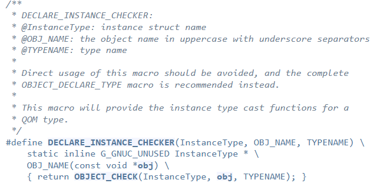
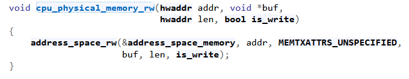

# Source code

## Struct
```cpp
typedef struct {
    PCIDevice pdev;
    struct {
		uint64_t src;
        uint8_t off;
	} state;
    char buff[BUFF_SIZE];
    MemoryRegion mmio;
} MariaState;
```


Look at [PCIDevice](https://elixir.bootlin.com/qemu/v6.2.0/source/include/hw/pci/pci.h#L268), [MemoryRegion](https://elixir.bootlin.com/qemu/v6.2.0/source/include/exec/memory.h#L720)


## [DECLARE_INSTANCE_CHECKER](https://elixir.bootlin.com/qemu/v6.2.0/source/include/qom/object.h#L164)



```cpp
#define TYPE_PCI_MARIA_DEVICE "maria"
//...
DECLARE_INSTANCE_CHECKER(MariaState, MARIA, TYPE_PCI_MARIA_DEVICE)
```

## maria_mmio_read && maria_mmio_write

[cpu_physical_memory_rw](https://elixir.bootlin.com/qemu/v6.2.0/source/softmmu/physmem.c#L2930)



- The cpu_physical_memory_rw function performs an MMU lookup to convert a physical address to the corresponding virtual address using the current CPU settings.
- The cpu_physical_memory_rw function in QEMU is responsible for accessing guest physical memory.
- This function allows the CPU to read from or write to guest physical memory.

[address_space_rw](https://elixir.bootlin.com/qemu/v6.2.0/source/include/exec/memory.h#L2498)


```cpp
static uint64_t maria_mmio_read(void *opaque, hwaddr addr, unsigned size) {
    MariaState *maria = (MariaState *)opaque;
    uint64_t val = 0;
    switch (addr) {
        case 0x00:
            cpu_physical_memory_rw(maria->state.src, &maria->buff[maria->state.off], BUFF_SIZE, 1);
            val = 0x600DC0DE;
            break;
        case 0x04:
            val = maria->state.src;
            break;
        case 0x08:
            val = maria->state.off;
            break;
        default:
            val = 0xDEADC0DE;
            break;
    }
    return val;
}
```

    &maria->buff[maria->state.off] -> maria->state.src

```cpp
static void maria_mmio_write(void *opaque, hwaddr addr, uint64_t val, unsigned size) {
    MariaState *maria = (MariaState *)opaque;
    switch (addr) {
        case 0x00:
            cpu_physical_memory_rw(maria->state.src, &maria->buff[maria->state.off], BUFF_SIZE, 0);
            break;
        case 0x04:
            maria->state.src = val;
            break;
        case 0x08:
            maria->state.off = val;
            break;
        default:
            break;
    }
}
```
    maria->state.src -> &maria->buff[maria->state.off] 


## [MemoryRegionOps](https://www.qemu.org/docs/master/devel/memory.html#mmio-operations)

[A deep dive into QEMU: memory regions](https://airbus-seclab.github.io/qemu_blog/regions.html)
```cpp
static const MemoryRegionOps maria_mmio_ops = {
    .read = maria_mmio_read,
    .write = maria_mmio_write,
    .endianness = DEVICE_NATIVE_ENDIAN,
    .valid = {
        .min_access_size = 4,
        .max_access_size = 4,
    },
    .impl = {
        .min_access_size = 4,
        .max_access_size = 4,
    },
};
```
- The .endianness field specifies the byte order (endianness) of the MMIO region. DEVICE_NATIVE_ENDIAN means that the endianness matches the native endianness of the host system.
- .valid.min_access_size, .valid.max_access_size define the access sizes (in bytes) which the device accepts; accesses outside this range will have device and bus specific behaviour (ignored, or machine check)
- .impl.min_access_size, .impl.max_access_size define the access sizes (in bytes) supported by the implementation; other access sizes will be emulated using the ones available. For example a 4-byte write will be emulated using four 1-byte writes, if .impl.max_access_size = 1.


## pci_maria_realize
```cpp
static void pci_maria_realize(PCIDevice *pdev, Error **errp) {
    MariaState *maria = MARIA(pdev);
    memory_region_init_io(&maria->mmio, OBJECT(maria), &maria_mmio_ops, maria, "maria-mmio", MARIA_MMIO_SIZE);
    pci_register_bar(pdev, 0, PCI_BASE_ADDRESS_SPACE_MEMORY, &maria->mmio);
}
```

[MMIO handling](https://www.qemu.org/docs/master/devel/multi-process.html#mmio-handling)
**The device emulation objects will use memory_region_init_io() to install their MMIO handlers, and pci_register_bar() to associate those handlers with a PCI BAR, as they do within QEMU currently.**


[memory_region_init_io](https://elixir.bootlin.com/qemu/v6.2.0/source/softmmu/memory.c#L1519), [Documentation](https://elixir.bootlin.com/qemu/v6.2.0/source/include/exec/memory.h#L1176)


`pci_register_bar(pdev, 0, PCI_BASE_ADDRESS_SPACE_MEMORY, &maria->mmio);`:
- Registers the memory region (`mmio`) as a PCI Base Address Register (BAR) for the "Maria" device.
- Parameters:
- `pdev`: The PCI device.
- `0`: The BAR index (usually 0 for the first BAR).
- `PCI_BASE_ADDRESS_SPACE_MEMORY`: Indicates that this BAR represents memory space (as opposed to I/O space).
- `&maria->mmio`: A pointer to the memory region structure.

**pci_maria_realize function initializes the memory-mapped I/O (MMIO) region for the “Maria” device, sets up its behavior using the maria_mmio_ops, and registers it as a BAR. This allows the device to interact with the system’s memory space.**

## maria_class_init

```cpp
static void maria_class_init(ObjectClass *class, void *data) {
    DeviceClass *dc = DEVICE_CLASS(class);
    PCIDeviceClass *k = PCI_DEVICE_CLASS(class);

    k->realize = pci_maria_realize;
    k->vendor_id = PCI_VENDOR_ID_QEMU;
    k->device_id = 0xDEAD;
    k->revision = 0x0;
    k->class_id = PCI_CLASS_OTHERS;

    set_bit(DEVICE_CATEGORY_MISC, dc->categories);
}
```


## pci_maria_register_types
```cpp
static void pci_maria_register_types(void) {
    static InterfaceInfo interfaces[] = {
        { INTERFACE_CONVENTIONAL_PCI_DEVICE },
        { },
    };
    static const TypeInfo maria_info = {
        .name = TYPE_PCI_MARIA_DEVICE,
        .parent = TYPE_PCI_DEVICE,
        .instance_size = sizeof(MariaState),
        .instance_init = maria_instance_init,
        .class_init = maria_class_init,
        .interfaces = interfaces,
    };

    type_register_static(&maria_info);
}
```

[InterfaceInfo](https://elixir.bootlin.com/qemu/v6.2.0/source/include/qom/object.h#L504)


- InterfaceInfo structures includes a single entry with the INTERFACE_CONVENTIONAL_PCI_DEVICE interface.

[INTERFACE_CONVENTIONAL_PCI_DEVICE](https://elixir.bootlin.com/qemu/v6.2.0/source/include/hw/pci/pci.h#L209)


- The INTERFACE_CONVENTIONAL_PCI_DEVICE interface represents the standard PCI device behavior.

[type_register_static](https://elixir.bootlin.com/qemu/v6.2.0/source/qom/object.c#L154), [document](https://elixir.bootlin.com/qemu/v6.2.0/source/include/qom/object.h#L818)


[TypeInfo](https://elixir.bootlin.com/qemu/v6.2.0/source/include/qom/object.h#L413)


- This function registers the “Maria” device type with QEMU. It ensures that QEMU recognizes and manages this custom device type.

## type_init
```cpp
type_init(pci_maria_register_types)
```

[type_init](https://elixir.bootlin.com/qemu/v6.2.0/source/include/qemu/module.h#L56)


- The type_init function initializes the custom device type registration. It ensures that the “Maria” device type is available during QEMU startup.
