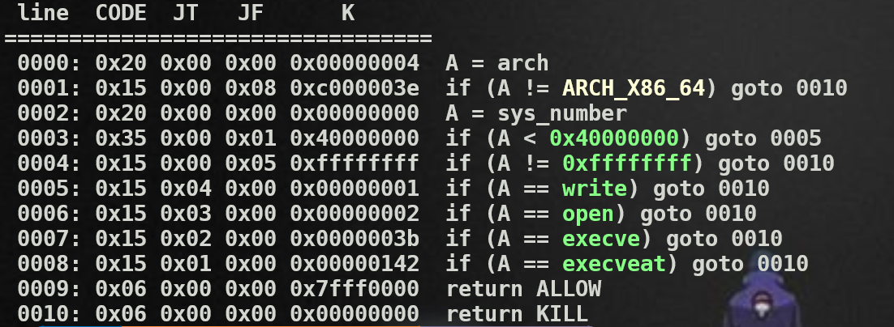

Useful syscall

```c
int openat(int dirfd, const char *pathname, int flags, mode_t mode);
```

```c
ssize_t sendfile(int out_fd, int in_fd, off_t *_Nullable offset, size_t count);
```

Read docker file, I can file the situation of the flag: /home/bypass_seccomp/flag
