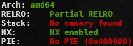
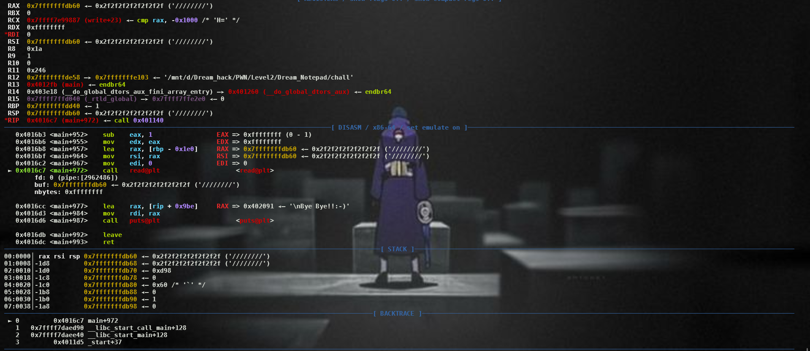

# Bug
```c
    FILE* p = fopen("/home/Dnote/note", "r");
    unsigned int size = 0;
    if (p > 0)
    {
        fseek(p, 0, SEEK_END);
        size = ftell(p) + 1;
        fclose(p);
        remove("/home/Dnote/note");
    }

    char message[256];

    puts("\n-----Leave a message-----");
    read(0, message, size - 1);
```

If the program can not open file, the value of size is 0. Thus, read will be return the big value.


