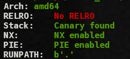
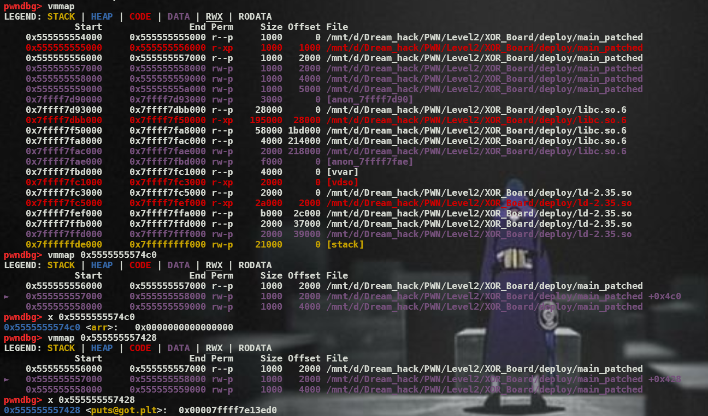
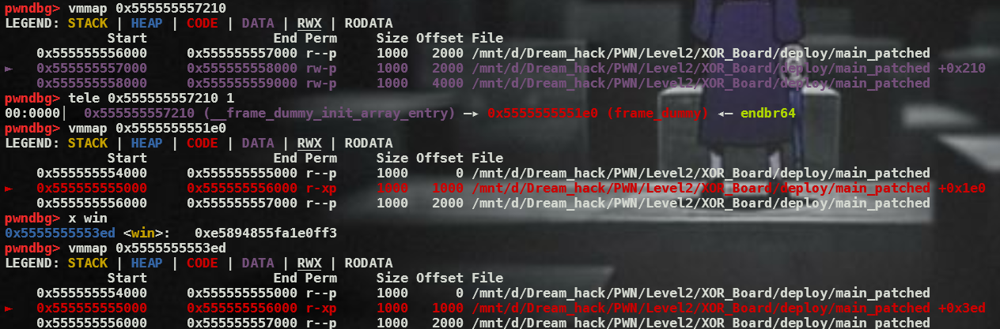
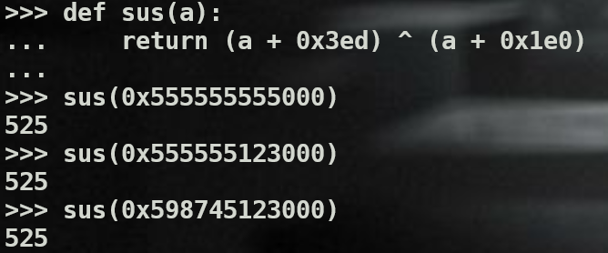

In this challenge, I have win function()
```c
void win() {
    system("/bin/sh");
}
```

# Bug

```c
void xor() {
    int32_t i, j;
    printf("Enter i & j > ");
    scanf("%d%d", &i, &j);
    arr[i] ^= arr[j];
}
```
- As you see, i and j are signed integers. Thus, I can input the negative number, which is out of range of arr.
- Therefore, I can leak some data and overwrite data.



I don't see the address that contains the address of the win function. However, I see this function.



So I need to transfer the above function to the win function.



I notice the special of this offset; however I don't know demonstrate this=))).