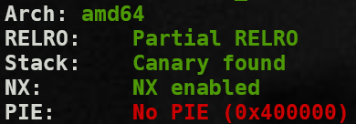
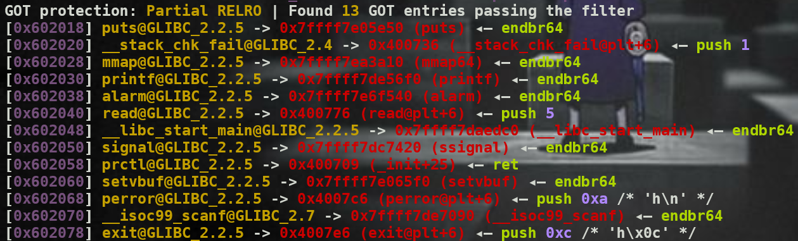

```c
int syscall_filter() {
    #define syscall_nr (offsetof(struct seccomp_data, nr))
    #define arch_nr (offsetof(struct seccomp_data, arch))
    
    /* architecture x86_64 */
    #define REG_SYSCALL REG_RAX
    #define ARCH_NR AUDIT_ARCH_X86_64
    struct sock_filter filter[] = {
        /* Validate architecture. */
        BPF_STMT(BPF_LD+BPF_W+BPF_ABS, arch_nr),
        BPF_JUMP(BPF_JMP+BPF_JEQ+BPF_K, ARCH_NR, 1, 0),
        BPF_STMT(BPF_RET+BPF_K, SECCOMP_RET_KILL),
        /* Get system call number. */
        BPF_STMT(BPF_LD+BPF_W+BPF_ABS, syscall_nr),
        };
    
    struct sock_fprog prog = {
    .len = (unsigned short)(sizeof(filter)/sizeof(filter[0])),
    .filter = filter,
        };
    if ( prctl(PR_SET_NO_NEW_PRIVS, 1, 0, 0, 0) == -1 ) {
        perror("prctl(PR_SET_NO_NEW_PRIVS)\n");
        return -1;
        }
    
    if ( prctl(PR_SET_SECCOMP, mode, &prog) == -1 ) {
        perror("Seccomp filter error\n");
        return -1;
        }
    return 0;
}
```

This function uses prctl to initiate filter. 

Look at the source code; I see the third option that it is possible to change value at the specific address.

It is not necessary to understand the filter. (*/ω＼*)

I can trigger filter by changing the follow of syscall_filter function (overwrite prctl got) to avoid initiating filter.


