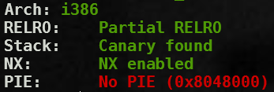

```c
void print_box(unsigned char *box, int idx) {
    printf("Element of index %d is : %02x\n", idx, box[idx]);
}
```
BUG: index out of range

```c
                printf("Name Size : ");
                scanf("%d", &name_len);
                printf("Name : ");
                read(0, name, name_len);
                return 0;
```

BUG: BOF
