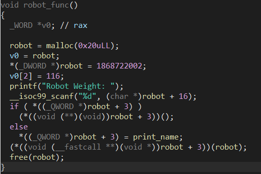

```c
struct Human {
  char name[16];
  int weight;
  long age;
};

struct Robot {
  char name[16];
  int weight;
  void (*fptr)();
};
```


```c
void human_func() {
  int sel;
  human = (struct Human *)malloc(sizeof(struct Human));

  strcpy(human->name, "Human");
  printf("Human Weight: ");
  scanf("%d", &human->weight);

  printf("Human Age: ");
  scanf("%ld", &human->age);

  free(human);
}
```
- The function inputs data to the heap memory with the fixed size, after which this free poiter of human. However, human_func doesn't clear data on this struct or mark its pointer. -> UAF


```c
void robot_func() {
  int sel;
  robot = (struct Robot *)malloc(sizeof(struct Robot));

  strcpy(robot->name, "Robot");
  printf("Robot Weight: ");
  scanf("%d", &robot->weight);

  if (robot->fptr)
    robot->fptr();
  else
    robot->fptr = print_name;

  robot->fptr(robot);

  free(robot);
}
```

- The function inputs data to the heap memory with the fixed size, after which this free poiter of robot. However, robot_func doesn't clear data on this struct or mark its pointer. -> UAF
- Vulnerability in `robot->fptr(robot);` that I can call my payload.

```c
int custom_func() {
  unsigned int size;
  unsigned int idx;
  if (c_idx > 9) {
    printf("Custom FULL!!\n");
    return 0;
  }

  printf("Size: ");
  scanf("%d", &size);

  if (size >= 0x100) {
    custom[c_idx] = malloc(size);
    printf("Data: ");
    read(0, custom[c_idx], size - 1);

    printf("Data: %s\n", custom[c_idx]);

    printf("Free idx: ");
    scanf("%d", &idx);

    if (idx < 10 && custom[idx]) {
      free(custom[idx]);
      custom[idx] = NULL;
    }
  }

  c_idx++;
}
```

- It checks the number of custom (heap)  and creates the memory of heap (malloc) with the size higher than 0xff.
- I also can call free at specific index of custom If I want; however, this function checks the range of idx and its pointer. -> legit =))

# Approach

BUG: UAF

## Part 1
The size of human and robot is fixed: 0x20 and I can only create a different size with this size in custom_func.
- Call robot_func to get the control 
- Robot_func can be associated with the human_func
- Vector: human_func -> robot_func -> call payload.

The fptr pointer of struct Robot have the same situation as the age (field) of struct Human.
+ UAF
=> Input the pointer to age field(function, gadget or something), after which Robot will recognize that this also be the fptr pointer.

Input to human: weight:0x50 + age:0x6c6f72746e6f43


## Part 2
Leak: heap, libc
Target: tcachebins + unsortedbins.


Leak libc with the unsortedbins is similar with the method above.

## The most effect solution: one_gadget.