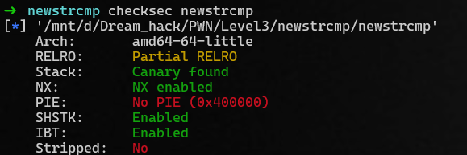

# Overall



No PIE, but canary

# Analyze

```c
int __fastcall main(int argc, const char **argv, const char **envp)
{
  int v4; // [rsp+10h] [rbp-50h]
  int v5; // [rsp+14h] [rbp-4Ch] BYREF
  int v6; // [rsp+18h] [rbp-48h]
  _BYTE buf[2]; // [rsp+1Eh] [rbp-42h] BYREF
  char chr16[16]; // [rsp+20h] [rbp-40h] BYREF
  __int64 v9; // [rsp+30h] [rbp-30h]
  __int64 v10; // [rsp+38h] [rbp-28h]
  _BYTE chr24[24]; // [rsp+40h] [rbp-20h] BYREF
  unsigned __int64 v12; // [rsp+58h] [rbp-8h]

  v12 = __readfsqword(0x28u);
  v9 = 0LL;
  v10 = 0LL;
  v4 = 0;
  setup();
  puts("Tester for newstrcmp");
  while ( 1 )
  {
    printf("Trial: %d\n", ++v4);
    printf("Exit? (y/n): ");
    read(0, buf, 2uLL);
    if ( buf[0] == 'y' )
      break;
    printf("Input string s1: ");
    read(0, chr16, 64uLL);
    printf("Input string s2: ");
    read(0, chr24, 64uLL);
    newstrcmp(chr16, chr24, &v5);
    printf("Result of newstrcmp: ");
    if ( v6 )
    {
      if ( v6 >= 0 )
        printf("s1 is larger than s2, first differs at %d\n", v5);
      else
        printf("s1 is smaller than s2, first differs at %d\n", v5);
    }
    else
    {
      puts("Two strings are the same!");
    }
  }
  return 0;
}
```

It is easy to see the vuln: BOF

```c
unsigned __int64 flag()
{
  char *argv[3]; // [rsp+10h] [rbp-20h] BYREF
  unsigned __int64 v2; // [rsp+28h] [rbp-8h]

  v2 = __readfsqword(0x28u);
  argv[0] = "/bin/sh";
  argv[1] = 0LL;
  execve("/bin/sh", argv, 0LL);
  return v2 - __readfsqword(0x28u);
}
```
&rarr; ret2win


```c
_DWORD *__fastcall newstrcmp(const char *a1, __int64 a2, _DWORD *a3)
{
  int v3; // edx
  _DWORD *result; // rax
  int i; // [rsp+28h] [rbp-8h]
  int v7; // [rsp+2Ch] [rbp-4h]

  v7 = strlen(a1);
  for ( i = 0; ; ++i )
  {
    if ( i >= v7 )
    {
      a3[1] = 0;
      result = a3;
      *a3 = -1;
      return result;
    }
    if ( a1[i] != *(i + a2) )
      break;
  }
  if ( a1[i] >= *(i + a2) )
    v3 = 1;
  else
    v3 = -1;
  a3[1] = v3;
  result = a3;
  *a3 = i;
  return result;
}
```

If I input str1 with a sufficiently large length and the same initial padding as str2, I can determine the byte adjacent to str1 through guessing.

While brute force is a straightforward method, I employ binary search to accelerate the process.

&rarr; Leak canary